# Lab de AI Code Review: OCR, GitLab CE e dois provedores

Este laboratório mostra o percurso de uma revisão de código: um modelo
encontra defeitos no diff, um segundo propõe correções, os gates testam o novo
commit e um bot distinto aprova o merge request. O cenário usa o
[Open Code Review](https://github.com/alibaba/open-code-review) pinado,
GitLab CE local, `deepseek-v4-pro` como revisor e `qwen38-27b` via Magalu como
corretor na execução de referência.

O laboratório responde perguntas concretas:

1. Como provar que o OCR revisou **todos** os arquivos selecionados e o SHA
   certo, mesmo quando a CLI pode publicar um resultado parcial?
2. Como impedir que código de um MR execute testes no host com segredos?
3. Quem comenta, corrige e aprova, e como conferir essas identidades no MR?
4. O que um pipeline verde comprova e o que depende do manifesto OCR?
5. Como ler custo, ancoragem, precisão e recall sem trocar denominadores?

O [livro do aluno](docs/lab-guide-student.md) conduz a prática. O
[atlas dos 32 scripts Python](docs/scripts.md) explica entradas, saídas,
pré-requisitos e efeitos. O [dossiê de resultados](docs/lab-results.md)
separa medição histórica do que um clone novo consegue reproduzir.

## Começar sem credenciais nem chamadas de modelo

Com Python 3.12+, `pre-commit` e acesso ao repositório:

~~~bash
git clone https://github.com/reinaldosaraiva/lab-alibaba-ocr.git
cd lab-alibaba-ocr
make study-check
~~~

`study-check` roda **52 testes do loop SaaS**, **3 testes da fixture de
desconto** e os hooks de pre-commit. Não precisa de GitLab, DeepSeek, Magalu
ou gold externo. A fixture correta está em
[`exercises/discount/`](exercises/discount/); o guia ensina a criar um bug
numa branch e observar o controle negativo.

Para subir o GitLab CE, siga o
[Módulo 3](docs/lab-guide-student.md#módulo-3--subir-o-gitlab-ce). Ele mostra
como clonar o OCR no commit pinado, aplicar o patch de CA e usar
`make lab-ocr` e `make lab-gitlab-up`. O bootstrap cria o projeto **vazio**
`lab/sandbox`; o guia explica como semear código e configurar o runner antes
de tentar um MR. `make lab-up` pertence à trilha de pesquisa com
`review-model` externo e não é o comando inicial desta edição.

## Topologia e fronteiras

```mermaid
flowchart LR
    S[Branch de estudo] --> G[GitLab CE: MR]
    G --> R[OCR + DeepSeek: review]
    R --> RC[saas-reviewer: comentários]
    RC --> F[Qwen38/Magalu: proposta]
    F --> BC[saas-bot: fix commit]
    BC --> Q[Testes isolados + pre-commit + CI]
    Q --> RR[OCR: nova revisão]
    RR --> A[saas-reviewer: aprovação]
    A --> M[Merge opcional]
```

| Componente | Função | Fronteira de confiança |
|---|---|---|
| `open-code-review` | seleciona arquivos, chama o revisor e emite findings/manifesto | clonado do upstream no SHA `01cf7ff8b94c5087205eaf47a6e67f94dabb2a32`; fonte não copiada para este repo |
| `scripts/saas/autofix_loop.py` | orquestra MR, review, fix, testes, CI, aprovação e merge opcional | valida modelo, SHA, seleção, manifesto, refs e pipeline |
| `scripts/saas/two_provider.py` | escreve resumo e propõe fix por finding | chaves em `.lab/` ou no perfil OCR, fora do Git |
| `saas-reviewer` | publica findings e aprova | OAuth G6; conta distinta da que aplica o fix |
| `saas-bot` | escreve nota de fix e assina commit | OAuth G6 para notas; push Git usa credencial do transporte |
| `ocr-bot` | transporte Git e bootstrap | token local do projeto; não é a identidade do parecer |
| `saas-quality` | testes e Ruff no GitLab CI | prova qualidade do commit; OCR roda fora do CI |

Os testes de código do MR rodam em snapshot `git archive` dentro de um
container Python pinado, sem rede, filesystem read-only e sem `.git` ou
segredos montados. A aprovação exige re-review completo, testes,
pre-commit, CI no SHA revisado e nova conferência das refs. Os controles
negativos estão no [Módulo 4](docs/lab-guide-student.md#módulo-4--gates-e-controles-negativos).

## Mapa do repositório

| Caminho | Conteúdo e uso |
|---|---|
| [`exercises/discount/`](exercises/discount/) | função correta e testes; branch do aluno introduz bug de desconto |
| [`scripts/saas/`](scripts/saas/) | driver, dois provedores, regra de review e 52 testes |
| [`scripts/lab/`](scripts/lab/) | bootstrap do GitLab, ferramentas, manifesto e verificação do modelo externo |
| [`scripts/benchmark/`](scripts/benchmark/) | piso Semgrep/Bandit/CodeQL e testes |
| [`scripts/spike/`](scripts/spike/) | S0-A (adapter), S0-B (GitLab/OAuth) e S0-C (50 MRs) |
| [`lab/gitlab/compose.yaml`](lab/gitlab/compose.yaml) | GitLab CE 18.4.1 e runner; HTTP/SSH em loopback |
| [`patches/ocr-root-ca-file.patch`](patches/ocr-root-ca-file.patch) | CA do gateway Magalu para o OCR pinado |
| [`data/mrs50/index.jsonl`](data/mrs50/index.jsonl) | refs/metadados dos 50 PRs; sem diffs |
| [`results/p001-s004-s0c/`](results/p001-s004-s0c/) | métricas e precisão resumidas, sem 200 JSONs brutos |
| `plans/` | histórico Reentry só no clone de pesquisa; fora da edição didática |

Todos os arquivos de `scripts/`, o Compose, o Makefile, o CI e a fixture
integram a edição do GitHub. O [atlas](docs/scripts.md) indica comandos
seguros sem credenciais e os que alteram GitLab ou consomem tokens.

## Resultado de referência

No GitLab CE do host de pesquisa, o MR !36 teve dois findings no primeiro
review do DeepSeek, dois fixes do Qwen, zero findings na nova revisão,
pipeline #60 verde, aprovação por `saas-reviewer` e merge. Esses IDs são de
`localhost:8929`; outro computador não consegue abrir o MR. O
[dossiê](docs/lab-results.md) registra também o timeout do !35, sem tratá-lo
como review aprovado.

Na medição S0-C, 50 MRs × 2 modelos × 2 esforços produziram 200 células:
139 completas, 1 parcial e 60 sem diff revisável. A ancoragem foi 165/166
findings; 99 findings amostrados foram julgados válidos **pela mesma pessoa em
duas passagens**, não por avaliadores independentes. Já o adapter L1 do S0-A
obteve FP 0/142 e recall de apenas 2/113 no gold unseen. Veja denominadores
e limitações antes de comparar modelos.

O spike S0-B foi concluído no GitLab CE; células GitLab.com Free continuam
pendentes. Este é um protótipo de laboratório, não um SaaS multi-tenant pronto
para produção.

## Segurança e operação

- `.lab/`, `open-code-review/`, `bin/` e `.qwen/` são ignorados pelo Git. Não
  copie tokens, certificados, URLs remotas com credenciais ou configs de
  provedor para commits e issues.
- O runner do Compose monta o socket Docker. Registre-o só onde pessoas
  confiáveis controlam o CI; pipelines de forks não confiáveis não pertencem
  a esse runner.
- `--auto-merge` integra código de verdade. O exercício começa sem essa flag,
  em branch e projeto descartáveis.
- `make lab-down` preserva volumes; `make lab-nuke` apaga volumes e
  credenciais. Leia o alvo antes de executá-lo.
- O OCR upstream tem licença Apache-2.0 na origem. O patch aqui é aplicado
  sobre clone local; a árvore upstream não é redistribuída.

Continue pelo [guia de estudo](docs/lab-guide-student.md) e use o
[atlas dos scripts](docs/scripts.md) para aprofundar cada spike.
