# Guia de estudo: revisão de código com dois provedores no GitLab

**Edição:** 1.0 · **Formato:** laboratório guiado · **Público:** pessoas que já
usam Git, Python e merge requests e querem estudar um revisor de código com
correção automática e gates verificáveis.

> **Objetivo:** ao terminar, você consegue explicar o caminho de um finding do
> OCR até uma correção, distinguir a identidade do revisor da do corretor,
> executar os checks locais, subir um GitLab CE descartável e interpretar por
> que um pipeline verde sozinho não prova que o review OCR terminou.

## Roteiro

| Módulo | Prática | Requer modelos? |
|---|---|---|
| 1 | Ler o fluxo e rodar testes e controles sintáticos | Não |
| 2 | Subir OCR e GitLab CE local | Não |
| 3 | Inspecionar os gates de confiança | Não |
| 4 | Observar ou executar um MR com dois provedores | Sim, para executar |
| 5 | Interpretar as medições de 50 MRs | Não |

## Antes de começar

Todos os comandos abaixo rodam no **terminal do host**, a partir da raiz deste
repositório, salvo indicação contrária. Use um clone de estudo: o Módulo 4
cria branch, commit e MR. Os módulos 1, 3 e 5 são locais e não precisam de
GitLab, contas ou tokens.

Para os módulos 1–3: Git, Python 3.12 ou superior, Go 1.26 ou superior,
Docker com Compose, `ruff` 0.16.8 e espaço para a imagem do GitLab CE.
`pre-commit` e `gitleaks` são necessários para reproduzir o gate completo de
commit. As versões usadas no lab estão em `scripts/lab/lab_tools.py`; o Módulo
1 pode ser feito somente com Python e Ruff. O Módulo 2 baixa o OCR upstream e
a imagem GitLab CE, portanto precisa de rede.

O Módulo 4 requer um projeto GitLab CE com runner registrado, um clone com
permissão de push, configuração local do DeepSeek e do gateway Magalu, duas
contas OAuth distintas (`saas-reviewer` e `saas-bot`) e seus tokens. Esse
provisionamento **não** é automatizado pelo bootstrap público. O revisor
DeepSeek pode consumir franquia ou gerar cobrança conforme sua conta; confira
o limite antes de executar o loop.

### Regras do laboratório

- `.lab/`, `.qwen/`, `bin/` e `open-code-review/` são ignorados pelo Git. Guarde
  tokens e certificados apenas em `.lab/` ou no gerenciador de credenciais.
- Nunca copie a URL de um remote que contenha credenciais para um relatório,
  issue ou captura de tela. Use `git remote get-url origin` somente no seu
  terminal, sem colar a saída em documentos.
- `--auto-merge` integra código de verdade. No exercício, use uma branch e um
  projeto descartáveis. O comando mostrado no Módulo 4 não ativa a flag.
- O runner tem acesso ao socket Docker do host. Registre-o apenas em um
  projeto de estudo onde somente pessoas confiáveis podem alterar o CI; não
  aceite pipelines de forks ou MRs não confiáveis nesse runner.
- `make lab-down` para os containers e preserva os volumes. `make lab-nuke`
  apaga volumes e credenciais do lab; é tarefa deliberada de quem o administra.

## Mapa do sistema

```mermaid
flowchart LR
  A[Branch de feature] --> B[MR no GitLab CE]
  B --> C[OCR + DeepSeek: findings]
  C --> D[saas-reviewer: comentários]
  D --> E[Qwen38/Magalu: proposta de fix]
  E --> F[saas-bot: commit e nota]
  F --> G[Testes isolados + pre-commit + pipeline]
  G --> H[OCR: nova revisão]
  H -->|sem findings e gates verdes| I[saas-reviewer: aprovação]
  I --> J[merge opcional]
```

`ocr-bot` é o transporte Git do lab; `saas-reviewer` publica o parecer e
aprova, enquanto `saas-bot` assina correções. Cada identidade tem um papel
observável no MR. A segunda revisão olha o código corrigido, não só a resposta
textual do fixer.

## Módulo 1 — Entender o loop sem chamar modelos

### 1.1 Localizar os estágios

Abra `scripts/saas/autofix_loop.py`, `scripts/saas/two_provider.py` e
`scripts/saas/review_rule.json`. Encontre no código:

1. a chamada OCR que recebe `--reviewer` e `--review-model`;
2. `summarize_findings`, que escreve o resumo do primeiro ciclo;
3. `fix_finding`, que propõe a correção;
4. os pontos que exigem revisão completa, testes, pipeline e SHA estável
   antes da aprovação.

**Pergunta:** por que `saas-bot` não pode aprovar a própria correção neste lab?
Compare os papéis de `bot_identities()` com os autores das notas de MR.

### 1.2 Executar os testes locais

~~~bash
python3 -m unittest discover -s scripts/saas -p 'test_*.py' -q
ruff check scripts/saas
ruff format --check scripts/saas
~~~

**Esperado:** 52 testes passam na revisão documentada; Ruff sai com código 0.
Uma versão futura pode ter mais testes. Esses testes usam doubles locais:
passar neles não chama modelos nem prova o GitLab remoto.

### 1.3 Controle negativo para o gate sintático

~~~bash
printf 'print(missing_variable)\n' | ruff check --isolated --select F821,E9 --no-cache --stdin-filename demo.py -
printf 'print("ok")\n' | ruff check --isolated --select F821,E9 --no-cache --stdin-filename demo.py -
~~~

**Esperado:** o primeiro comando falha com `F821`; o segundo passa. O uso de
`--isolated` fixa a semântica do gate diante de configurações Ruff de outro
projeto. O gate também seleciona erros de parser da família `E9`.

**Registre:** qual mudança mínima faria o primeiro controle passar? O que
esse teste *não* detecta sobre a lógica de uma função?

## Módulo 2 — Subir o GitLab CE local

### 2.1 Construir a versão pinada do OCR

Na raiz deste repositório:

~~~bash
git clone https://github.com/alibaba/open-code-review.git open-code-review
git -C open-code-review checkout 01cf7ff8b94c5087205eaf47a6e67f94dabb2a32
git -C open-code-review apply ../patches/ocr-root-ca-file.patch
make lab-ocr
bin/ocr version
~~~

**Esperado:** `bin/ocr` responde com a versão. O patch torna possível passar
uma CA própria ao OCR por `OCR_ROOT_CA_FILE`, necessária para o gateway Magalu
do lab. Ele não inclui certificado nem credencial. Se você não usará o
gateway, pode pular o `git apply`; o módulo local funciona sem essa CA.

Se `open-code-review/` já existe, confira seu commit e o diff antes de aplicar
o patch novamente. `make lab-ocr` tem fallback npm quando o build da fonte
falha, mas esse caminho não cria o `bin/ocr` exigido pelo exercício. Se isso
acontecer, corrija o erro do build e repita até `.lab/ocr-install` indicar
`build-from-source`.

### 2.2 Criar o sandbox GitLab

~~~bash
make lab-gitlab-up
curl -fsS http://localhost:8929/-/readiness
~~~

**Esperado:** o GitLab CE 18.4.1 responde e o bootstrap cria o projeto
`lab/sandbox`. A primeira subida demora mais que os comandos de teste.
O script guarda credenciais em `.lab/`, que não é versionado. As portas HTTP e
SSH do Compose ficam ligadas apenas ao loopback do host.

`make lab-up` também verifica o ambiente de um repositório externo de modelo
usado na pesquisa original; por isso, para este guia público, use os alvos
`lab-ocr` e `lab-gitlab-up` separadamente. Após reiniciar Docker em um lab
existente, suba o Compose diretamente para preservar os tokens do bootstrap:

~~~bash
docker compose -f lab/gitlab/compose.yaml --env-file .lab/gitlab.env up -d
~~~

**Pergunta:** qual parte depende de um processo local e qual parte pode ser
substituída por outro GitLab? Liste o que o arquivo `lab/gitlab/compose.yaml`
expõe em portas e volumes.

## Módulo 3 — Inspecionar os gates de confiança

Leia `review_rule.json` e procure as funções `validate_review_result`,
`require_trusted_ci`, `isolated_tests` e `assert_refs_unchanged` em
`autofix_loop.py`. Registre a decisão que cada uma toma:

| Gate | Evidência exigida | Falha que evita |
|---|---|---|
| Review OCR | seleção de arquivos, manifesto completo, modelo e SHA esperados | aprovar review parcial ou de outro commit |
| Regra de review | regra local confiável, incluindo testes e proteção contra instruções no diff | obedecer a texto malicioso dentro do MR |
| Testes | snapshot `git archive` em container sem rede e sem `.git` ou segredos montados | executar código do MR no host com credenciais |
| CI | configuração igual à do alvo e pipeline `success` no SHA revisado | trocar o gate no próprio MR |
| Merge | alvo e fonte conferidos antes da aprovação e imediatamente antes do PUT | aprovar código ou base que mudou |

**Controle mental:** um pipeline verde de `saas-quality` prova testes e lint
do commit. Ele não prova, por si só, que o OCR terminou. O driver exige os dois
conjuntos de evidências. O job `ocr-review` separado ainda não existe neste
lab; não chame o badge atual de “review OCR verde”.

**Limite:** a última consulta de refs e o PUT de merge são duas operações; uma
alteração do alvo nesse intervalo ainda é possível. Garantia atômica depende
de suporte do servidor, além deste driver.

## Módulo 4 — Observar um merge request com dois provedores

### 4.1 Ler uma execução registrada

O caso de referência foi o MR local **!36** no projeto `lab/sandbox` em
28/09/2026. O primeiro review do `deepseek-v4-pro` registrou 2 findings;
`qwen38-27b` via Magalu aplicou 2 fixes em commit de `saas-bot`; o segundo
review do DeepSeek retornou 0 findings. A pipeline #60 terminou em `success`;
`saas-reviewer` aprovou e o MR foi integrado ao `develop`.
É uma observação histórica do host de origem; esse MR em `localhost` não pode
ser aberto por quem clonou a edição pública no próprio computador.

| Evidência | O que conferir no seu MR |
|---|---|
| Discussões | autor `saas-reviewer` nos findings |
| Commit de correção | autor `saas-bot` |
| Nota de fix | autor `saas-bot` |
| Aprovação | `approved_by` contém `saas-reviewer` |
| Pipeline | job `saas-quality` verde no SHA revisado |
| Nova revisão | 0 findings e manifesto OCR completo |

Esse registro demonstra o fluxo no ambiente de referência; a URL
`localhost:8929` só funciona no host onde o lab está rodando.

### 4.2 Executar no seu sandbox (opcional, operador)

Configure primeiro os dois provedores e as duas identidades OAuth locais.
`two_provider.py` lê Magalu de `.lab/ocr-config.json` e DeepSeek de
`~/.opencodereview/config.json`; o OCR usa `.lab/magalu-ca.pem` quando revisa
pelo gateway. O driver retira `OCR_ROOT_CA_FILE` ao chamar o DeepSeek direto,
pois o patch troca as raízes TLS pelas da CA local quando essa variável está
presente. O driver exige `GITLAB_REVIEWER_USERNAME/PASSWORD` e
`GITLAB_BOT_USERNAME/PASSWORD` no ambiente. Não registre esses valores no MR.

No clone descartável do projeto GitLab, crie uma branch a partir de `develop`,
adicione uma pequena função e um teste que revele um defeito lógico, e faça
um commit convencional. Mantenha a árvore limpa antes de chamar o driver.
Exemplo de invocação **sem merge automático** a partir da raiz deste repo:

~~~bash
OCR_ROOT_CA_FILE=.lab/magalu-ca.pem python3 scripts/saas/autofix_loop.py \
  --repo .qwen/tmp/sandbox-clone \
  --branch minha-branch-de-estudo \
  --target develop \
  --reviewer deepseek \
  --review-model deepseek-v4-pro \
  --fixer magalu \
  --effort medium \
  --max-tokens-budget 100000 \
  --test-cmd 'python3 -m unittest discover -s scripts/saas -p test_*.py -q'
~~~

O valor de `--test-cmd` é executado no **snapshot do projeto revisado**.
Escolha o teste do projeto do MR; o exemplo acima só serve se esse projeto
contiver a suíte `scripts/saas`. Não use `--auto-merge` no primeiro exercício.
Se o review, o fixer, os testes ou o pipeline falharem, o loop deve parar sem
aprovação. Registre o motivo, o SHA e o ciclo; não tente “dar verde” manual ao
MR como se a revisão tivesse sido concluída.

## Módulo 5 — Interpretar o benchmark

A pesquisa S0-C revisou 50 MRs de três projetos públicos (Python, Go e
TypeScript/JavaScript) com dois modelos e dois níveis de esforço:
`50 × 2 × 2 = 200` células. O [resumo de métricas](../results/p001-s004-s0c/metrics.md)
registra 139 completos, 1 parcial e 60 `skipped` por diff sem itens revisáveis.
Não divida os findings por 200 para estimar findings por review executado.

No recorte `medium` completo, o Qwen teve 35 runs e mediana de 43 s; o
DeepSeek teve 35 runs e mediana de 130 s. A ancoragem dos findings foi 96%
e 100%, respectivamente. São medidas deste corpus e infraestrutura, não um
SLO geral de produção. O [relato de precisão](../results/p001-s004-s0c/precision.md)
usa 99 findings marcados duas vezes pela **mesma pessoa**: o acordo de 100%
mede consistência dessa anotação, não concordância entre revisores
independentes.

**Exercício:** calcule a fração de células completas, a fração `skipped` e a
diferença entre “ancoragem correta” e “finding verdadeiro”. Explique por que
o custo pay-as-you-go medido como US$ 0,00 nesse experimento não equivale a
infraestrutura grátis: os endpoints estavam cobertos por planos de assinatura.

## Fechamento e respostas esperadas

- A aprovação exige review completo no SHA revisado, checks verdes e contas
  separadas para revisão e correção.
- `F821` detecta um nome indefinido, mas não prova que a lógica do desconto,
  da autorização ou de qualquer outra função está correta.
- Um `skipped` não é um review limpo: não havia diff revisável naquela célula.
- O resultado do GitLab CE local não resolve, sozinho, os mecanismos e os
  assentos no GitLab.com Free. Essa etapa da pesquisa continua pendente.

Ao terminar o laboratório, pare os containers com `make lab-down` se não
precisar mantê-los ativos. Preserve suas anotações sem copiar segredos de
`.lab/`.
