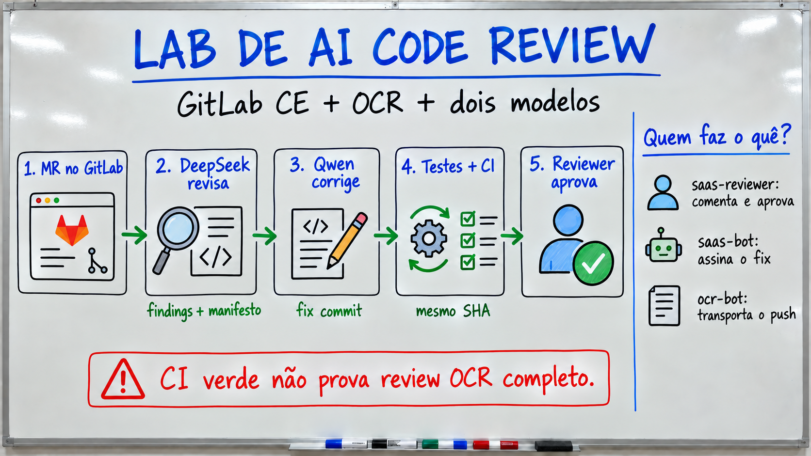

# Laboratório guiado: revisão, correção e aprovação de um MR

Este guia acompanha o [README](../README.md), o [atlas dos scripts](scripts.md)
e o [dossiê de resultados](lab-results.md). A trilha começa sem credenciais,
passa por um GitLab CE local e termina com um MR em que **DeepSeek revisa**,
**Qwen38/Magalu corrige** e duas contas OAuth registram seus atos. Os números
históricos são identificados como tal; as evidências do seu computador devem
ser registradas separadamente.

## Objetivos e mapa de execução

Ao terminar, você deve conseguir responder com um SHA e uma evidência para
cada uma destas perguntas:

1. Qual diff o modelo viu e quantos arquivos selecionados foram concluídos?
2. Qual conta publicou o finding, qual conta assinou o fix e quem aprovou?
3. O que cada gate rejeita antes do commit, depois do push e antes do merge?
4. O que um pipeline verde prova quando o OCR roda fora do CI?
5. Que parte do benchmark pode ser refeita com o material publicado?

| Módulo | Atividade | Credenciais/modelos | Saída |
|---|---|---|---|
| 1 | Testes e mapa do repositório | nenhum | baseline local verde |
| 2 | Bug de desconto e F821 | nenhum | dois controles negativos |
| 3 | OCR pinado e GitLab CE | Docker e acesso local | projeto `lab/sandbox` vazio |
| 4 | Gates de confiança | nenhum | matriz de falhas e provas |
| 5 | MR com dois provedores | duas APIs, OAuth e runner | review, fix, re-review e aprovação |
| 6 | Ler S0-C | nenhum para os resumos | denominadores corretos |
| 7 | Ler S0-A/S0-B | nenhum para os resumos | limites de recall e tier |

Comandos de shell partem da raiz do clone, exceto onde aparece `cd`. Em macOS
ou Linux, instale Python 3.12+, `pre-commit`, Git, Docker e `make`. O
`pre-commit` baixa os hooks pinados na primeira execução. Para construir o
OCR, também são necessários Go e Node conforme o `Makefile` do upstream. O
GitLab CE demanda memória e tempo de inicialização; confirme capacidade do
seu host antes do Módulo 3. A edição didática não instala o `review-model`
externo nem publica segredos.

### Vocabulário de evidência

- **Finding:** comentário de revisão com caminho, linha, severidade e texto.
- **Head SHA:** commit da branch de origem que foi revisado. Um novo push
  torna obsoleta a aprovação do SHA anterior.
- **Manifesto OCR:** prova de seleção, conclusão, falhas, modelo e refs da
  execução; `status: complete` isolado não é suficiente.
- **Pipeline:** jobs do GitLab sobre um SHA. Nesta edição, `saas-quality`
  roda testes e Ruff. O OCR é chamado pelo driver externo.
- **Convergência:** nova revisão com zero findings, manifesto completo,
  testes, hooks e CI verdes no mesmo head SHA, seguidos de aprovação.

## Módulo 1 — Baseline sem modelo

### 1.1 Rode os checks portáteis

~~~bash
make study-check
~~~

**Esperado:** 52 testes em `scripts/saas/`, 3 em `exercises/discount/` e
todos os hooks de pre-commit com exit code 0. O comando não chama GitLab nem
LLM. Se os hooks ainda não estão em cache, a primeira execução precisa de
rede para instalar as versões fixadas em `.pre-commit-config.yaml`.

Para inspecionar as trilhas de pesquisa sem executá-las:

~~~bash
python3 scripts/saas/autofix_loop.py --help
python3 scripts/saas/two_provider.py --help
python3 -m unittest discover -s scripts/benchmark -p 'test_*.py' -q
python3 -m unittest discover -s scripts/spike -p 'test_*.py' -q
~~~

**Observe:** os testes unitários usam doubles e não reproduzem um review
real. O [atlas](scripts.md) explica quais scripts têm efeitos remotos e quais
dependem do gold externo.

### 1.2 Localize o fluxo

Abra, nesta ordem, [`review_rule.json`](../scripts/saas/review_rule.json),
[`two_provider.py`](../scripts/saas/two_provider.py),
[`autofix_loop.py`](../scripts/saas/autofix_loop.py) e
[`.gitlab-ci.yml`](../.gitlab-ci.yml). A regra de review vem do repositório
confiável. O driver a passa ao OCR, valida o resultado, publica findings,
solicita um patch ao fixer, testa, faz push e só então revisa outra vez.

> **Pergunta:** por que o resumo do ciclo 1 e o patch são gerados pelo Qwen,
> enquanto os findings originais pertencem ao DeepSeek?

## Módulo 2 — Fixture e controles negativos

O arquivo [`price.py`](../exercises/discount/price.py) implementa
`discounted_price(price_cents, discount_percent)`. O preço é inteiro em
centavos. Para 12.000 centavos e 33%, o resultado correto é 8.040. O teste
fica em [`test_price.py`](../exercises/discount/test_price.py).

### 2.1 Prove que o teste distingue comportamento

Não altere a cópia principal. Faça o experimento numa pasta temporária:

~~~bash
tmp_dir=$(mktemp -d)
cp exercises/discount/price.py exercises/discount/test_price.py "$tmp_dir/"
python3 - "$tmp_dir/price.py" <<'PY'
from pathlib import Path
import sys

path = Path(sys.argv[1])
source = path.read_text()
correct = "price_cents * (100 - discount_percent) // 100"
assert correct in source
path.write_text(source.replace(correct, "price_cents * discount_percent // 100"))
PY
python3 -m unittest discover -s "$tmp_dir" -p 'test_*.py' -q
~~~

**Esperado:** exit code diferente de zero e falha no caso de 33% ou nos
limites. A mutação calcula o valor do desconto em vez do preço final. O
controle prova que a suíte detecta esse erro específico; não prova cobertura
de todos os defeitos. Remova o diretório temporário quando terminar.

### 2.2 Prove o gate sintático do fixer

O gate em `autofix_loop.py` usa `ruff check --isolated --select F821,E9` se
`ruff` estiver no `PATH`. Um nome indefinido deve falhar:

~~~bash
printf 'def price():\n    return missing_price\n' > "$tmp_dir/undefined.py"
ruff check --isolated --select F821,E9 "$tmp_dir/undefined.py"
printf 'def price():\n    return 100\n' > "$tmp_dir/defined.py"
ruff check --isolated --select F821,E9 "$tmp_dir/defined.py"
~~~

**Esperado:** o primeiro comando aponta `F821` e retorna erro; o segundo
passa. Instale Ruff se quiser executar esse controle manualmente. No driver,
sem Ruff disponível, o fallback é `py_compile`, que verifica sintaxe mas
**não** detecta nome indefinido. A proteção F821 depende de Ruff no `PATH`.

## Módulo 3 — Subir o GitLab CE

Esta parte cria serviços locais. As portas HTTP 8929 e SSH 2224 estão
vinculadas a `127.0.0.1` no Compose. O runner monta o socket Docker: só
registre e use esse runner em projeto cujos autores do CI sejam confiáveis.

### 3.1 Construa o OCR no commit estudado

O alvo `make lab-ocr` tenta compilar do código fonte. Se a compilação
falhar, ele executa `npm install -g @alibaba-group/open-code-review@1.12.8`,
que modifica a instalação global do Node e pode exigir permissão. Para este
exercício, o resultado válido é o binário construído da fonte pinada; leia
o log e pare se a compilação falhar.

~~~bash
git clone https://github.com/alibaba/open-code-review.git open-code-review
git -C open-code-review checkout 01cf7ff8b94c5087205eaf47a6e67f94dabb2a32
git -C open-code-review apply ../patches/ocr-root-ca-file.patch
make lab-ocr
cat .lab/ocr-install
bin/ocr version
~~~

**Esperado:** `.lab/ocr-install` contém `build-from-source` e `bin/ocr`
responde. A árvore do upstream e o binário são locais e ignorados pelo Git.
O patch adiciona suporte à CA do gateway Magalu. Se `make lab-ocr` cair no
fallback npm, `bin/ocr` não é criado: corrija a compilação do upstream antes
de seguir ao MR. Um clone já patcheado não deve receber o patch de novo.

### 3.2 Faça o bootstrap do CE

~~~bash
make lab-gitlab-up
curl -fsS http://localhost:8929/-/readiness
~~~

**Esperado:** o bootstrap grava `.lab/gitlab.env` e `.lab/gitlab.json` com
permissões restritas, cria group `lab`, projeto `sandbox` **vazio** e usuário
`ocr-bot`. A primeira subida pode levar vários minutos. Guarde `.lab/` fora
de commits e anexos de issue. O comando não semeia `main`/`develop`, não
registra runner e não cria as contas `saas-reviewer` e `saas-bot`.

Para religar o CE depois de reiniciar o Docker, sem repetir o bootstrap:

~~~bash
docker compose --env-file .lab/gitlab.env -f lab/gitlab/compose.yaml up -d
~~~

O bootstrap pode rotacionar o token do bot e invalidar um clone cujo push
usa a credencial anterior. `make lab-down` para os containers e mantém os
volumes. `make lab-nuke` remove volumes e credenciais do lab; use apenas
quando quiser recomeçar a instância.

### 3.3 Prepare um projeto de estudo

Quem for executar o Módulo 5 precisa de um clone de trabalho **separado**
com `origin` apontando para `lab/sandbox` e autenticação de push. Use um
credential helper do Git ou outro mecanismo local; não cole token em
comandos que possam ir ao histórico do shell. O instrutor deve semear a
edição didática em `main`, criar `develop`, configurar um runner confiável e
provisionar as duas contas OAuth. O bootstrap do Módulo 3, sozinho, não
entrega essa configuração.

Se `lab/sandbox` ainda estiver vazio, um esboço de seed é:

~~~bash
git clone http://localhost:8929/lab/sandbox.git .lab/study-sandbox
git -C .lab/study-sandbox fetch https://github.com/reinaldosaraiva/lab-alibaba-ocr.git main
git -C .lab/study-sandbox switch -c main FETCH_HEAD
git -C .lab/study-sandbox push -u origin main
git -C .lab/study-sandbox switch -c develop
git -C .lab/study-sandbox push -u origin develop
~~~

O push exige credencial com acesso ao projeto. Se a instância já tiver
branches, inspecione-as e adapte o seed; não sobrescreva histórico existente.
Depois, confirme que `.gitlab-ci.yml` é igual em `develop` e na branch do
exercício. O driver bloqueia alterações de CI feitas pela branch de origem.

### 3.4 Registre o runner no sandbox confiável

No GitLab CE local, abra **Admin Area → CI/CD → Runners → New instance runner**.
Crie um runner que aceite jobs sem tag e copie seu token de autenticação para
uma variável de shell local `RUNNER_TOKEN`, sem salvá-lo em arquivo versionado
ou colá-lo no histórico. Este runner executará o `saas-quality` do projeto.
Na raiz do repositório:

~~~bash
RUNNER_TOKEN=$(python3 -c 'import getpass; print(getpass.getpass("Runner token: "))')
docker run --rm --network host \
  -v gitlab_runner_config:/etc/gitlab-runner \
  gitlab/gitlab-runner:v18.4.0 register \
  --non-interactive \
  --url http://localhost:8929 \
  --token "$RUNNER_TOKEN" \
  --executor docker \
  --docker-image python:3.12@sha256:4d1caded1f729ae443eb803f26ffde7b61e696aeaef62f099abb6dd6b14257c7 \
  --docker-network-mode host \
  --name study-runner
unset RUNNER_TOKEN
docker compose --env-file .lab/gitlab.env -f lab/gitlab/compose.yaml restart gitlab-runner
~~~

O volume `gitlab_runner_config` é o volume nomeado do Compose deste lab.
Confirme em **Admin Area → CI/CD → Runners** que o runner está online. Se
o job ficar pendente, confira se o registro persistiu em `config.toml` e
se `network_mode = "host"` aparece no bloco `[runners.docker]`; o script
histórico [`s0b_runner_ci.py`](../scripts/spike/s0b_runner_ci.py) mostra
como o lab ajustou esse campo no Docker Desktop. Não execute o spike inteiro
só para registrar o runner: ele cria MRs e pipelines de prova. O runner
monta o socket Docker, portanto mantenha este projeto e seu CI sob autores
confiáveis.

## Módulo 4 — Gates e controles negativos

Leia os métodos citados na tabela em
[`autofix_loop.py`](../scripts/saas/autofix_loop.py). Execute os testes do
Módulo 1 e relacione cada falha com a fronteira que ela protege.

| Gate | Dado conferido | Controle negativo / efeito |
|---|---|---|
| `require_trusted_ci` | `.gitlab-ci.yml` em `origin/develop` e source | CI alterado na branch: MR exige revisão humana |
| `review_preview` + `validate_review_result` | arquivos previstos vs selecionados; completed/reused; failed/waived; modelo e SHAs | resultado parcial, seleção menor ou SHA errado: nenhum finding vira aprovação |
| `gate_check` | F821/E9 em cada fix Python | nome indefinido: fix revertido antes do commit, se Ruff estiver instalado |
| `isolated_tests` | `git archive` do tree candidato | teste falho: fix não vira commit |
| `trusted_precommit` | arquivos alterados com config pinada | hook falho ou alteração no worktree: bloqueio |
| `trigger_pipeline` + `wait_pipeline` | job CI no head SHA revisado | CI vermelho, timeout ou SHA diferente: sem aprovação |
| `assert_refs_unchanged` | target e source no remoto | push concorrente: aborta a aprovação/merge |
| `approve_review` | `approved_by` inclui a conta reviewer | aprovação ausente: não declara convergência |

O container de `isolated_tests` recebe um snapshot do Git, montado
somente para leitura, sem `.git`, sem segredos do host, sem rede, com usuário
sem privilégios e limites de memória/CPU. O `--test-cmd` é dividido em
argumentos e executado **dentro** dele. O driver também executa OCR,
pre-commit, Git e chamadas GitLab fora do container; trate regras e configs
locais como material confiável.

**Dois controles negativos adicionais:**

1. Remova um item de `completed` do manifesto em um teste unitário de
   `validate_review_result`: a revisão não deve ser aceita. A suíte já
   cobre essas classes de erro em `test_autofix_loop.py`.
2. Compare o resultado do Módulo 2 com o `saas-quality` do CI. Quando a
   branch contém o bug de desconto, o job deve falhar no teste. Depois da
   correção, deve passar no SHA novo. O badge de CI não certifica a revisão
   OCR: não existe job `ocr-review` funcional nesta edição.

**Risco residual para discutir:** a branch alvo pode mudar entre a última
checagem e a aceitação do merge pela API. O driver reconsulta as refs e usa
o SHA da source no pedido de merge, mas o resultado deve ser inspecionado
quando houver concorrência intensa. Texto em diff/MR também pode tentar
instruir o modelo; a regra confiável fica fora da branch do MR.

## Módulo 5 — MR com dois provedores

O quadro ilustra um percurso possível. O driver só declara convergência
quando a execução real entrega manifesto completo, zero findings, testes e
CI verdes no SHA final e aprovação registrada. Para facilitar a leitura,
a figura escreve o desconto como `0.33`; a fixture Python usa o inteiro
`33` e divide por `100`.

Este é o exercício avançado. Ele exige DeepSeek, Magalu, OCR compilado,
GitLab CE com runner registrado, projeto semeado e contas distintas
`saas-reviewer`/`saas-bot` com OAuth G6. Os segredos ficam em `.lab/` ou no
perfil local do OCR. O driver lê `.lab/gitlab.json` e
`.lab/gitlab.env`; `two_provider.py` lê `.lab/ocr-config.json`, a CA
`.lab/magalu-ca.pem` e o perfil DeepSeek do OCR. Veja os nomes esperados no
início de `two_provider.py` e em `bot_identities`. Não publique exemplos com
valores reais dessas chaves.

**Modelo observado no host de pesquisa:** reviewer `deepseek-v4-pro` via
DeepSeek e fixer `qwen38-27b` via Magalu. O preço zero registrado para o
fixer é o custo incremental do endpoint usado naquele host; não é garantia
de gratuidade para outra conta ou da infraestrutura.

### 5.1 Abra uma branch com um defeito observável

Use o clone `.lab/study-sandbox` preparado no Módulo 3. Crie uma branch a
partir de `develop`, mude somente a implementação e mantenha os testes:

~~~bash
git -C .lab/study-sandbox switch develop
git -C .lab/study-sandbox switch -c study/discount-bug
python3 - .lab/study-sandbox/exercises/discount/price.py <<'PY'
from pathlib import Path
import sys

path = Path(sys.argv[1])
source = path.read_text()
correct = "price_cents * (100 - discount_percent) // 100"
assert correct in source
path.write_text(source.replace(correct, "price_cents * discount_percent // 100"))
PY
git -C .lab/study-sandbox add exercises/discount/price.py
git -C .lab/study-sandbox commit -m 'test(study): demonstrate incorrect discount'
~~~

O commit inicial é deliberadamente incorreto e só vai para o sandbox. O
pipeline inicial deve reprovar no teste da fixture; o objetivo do loop é
produzir um fix, revisá-lo de novo e obter pipeline verde no novo SHA.
Confirme árvore limpa com `git -C .lab/study-sandbox status --short`.

### 5.2 Execute o driver, sem merge automático na primeira tentativa

No diretório raiz deste repositório, com o ambiente de provedor preparado:

~~~bash
OCR_ROOT_CA_FILE=.lab/magalu-ca.pem \
python3 scripts/saas/autofix_loop.py \
  --repo .lab/study-sandbox \
  --branch study/discount-bug \
  --target develop \
  --title 'study: correct discount calculation' \
  --reviewer deepseek \
  --review-model deepseek-v4-pro \
  --fixer magalu \
  --max-cycles 3 \
  --test-cmd 'python3 -m unittest discover -s exercises/discount -p test_*.py -q'
~~~

O driver retira `OCR_ROOT_CA_FILE` do subprocesso OCR quando o reviewer é
DeepSeek, pois ele usa as raízes TLS do sistema. `two_provider.py` usa a CA
do Magalu para gerar o summary e o fix. A conta `saas-reviewer` publica o
summary e os comentários do review; `saas-bot` posta a nota de correção e
assina o fix commit. O push Git usa o transporte configurado no clone. Cada push
do bot é seguido de disparo explícito do pipeline via API, pois o GitLab CE
do lab não o iniciou automaticamente nesse fluxo.

**Resultado esperado, não garantido:** o OCR encontra o defeito, o Qwen
produz patch aplicável, o teste e os hooks passam, a nova revisão tem zero
findings, o pipeline do novo SHA passa e `saas-reviewer` aprova. Modelos
podem não encontrar o bug ou produzir um patch inaplicável; nesse caso, o
driver registra a razão e não deve ser tratado como convergência. Salve o
veredito e compare com a matriz do Módulo 4.

### 5.3 Confira as provas no MR

No GitLab CE, anote sem copiar tokens:

| Campo | Onde conferir | Evidência mínima |
|---|---|---|
| Modelo reviewer | summary, log e manifesto OCR | `deepseek/deepseek-v4-pro` |
| Modelo fixer | nota do fix e commit | `magalu/qwen38-27b` |
| Cobertura | manifesto | selected = completed + reused; failed = waived = 0 |
| Identidade reviewer | campo Reviewer, comentários, `approved_by` | `saas-reviewer` |
| Identidade fixer | autor do fix commit, nota de fix | `saas-bot` |
| CI | pipeline e seu SHA | `saas-quality` verde no SHA final |
| Convergência | re-review e aprovação | 0 findings no SHA final |

Se quiser executar o merge automático em **outro MR descartável** depois
de verificar o fluxo, acrescente `--auto-merge`. Essa flag faz merge real
assim que a convergência é confirmada; por isso o primeiro exercício deixa
o MR aberto para inspeção. `--mr-iid N` retoma um MR já criado, desde que
o clone esteja na branch source correta.

### 5.4 Compare com a execução de referência

O MR local **!36** do host de pesquisa teve dois findings no ciclo 1,
dois fixes por Qwen, zero findings no ciclo 2, pipeline #60 verde,
aprovação por `saas-reviewer` e merge em `develop`. O MR **!35** teve
timeout de OCR em 600 s e não é prova de aprovação automática. Os demos
!23/!25 mostraram regressões do fixer detectadas na segunda revisão. Leia
os detalhes e limites em [Resultados do laboratório](lab-results.md#1-loop-de-review-e-correção-no-gitlab-ce).

## Módulo 6 — Como ler o benchmark S0-C

O índice [`data/mrs50/index.jsonl`](../data/mrs50/index.jsonl) lista 50
PRs merged de três projetos. A matriz histórica foi 50 × 2 modelos × 2
esforços, totalizando 200 células. O material publicado inclui scripts e
resumos, mas não os JSONs brutos das 200 execuções. Repetir o batch consome
modelos, rede e tempo; consulte o [atlas S0-C](scripts.md#s0-c-50-mrs-custo-latência-e-precisão)
antes de executá-lo.

### Exercício de denominadores

1. Some 139 completas + 1 parcial + 60 sem diff revisável. O total deve
   ser 200. A parcial não deve entrar no grupo completo.
2. Divida 165 por 166 para a ancoragem dos findings. Não divida por 200:
   células e findings são unidades diferentes.
3. Compare as medianas `medium`: 43 s Qwen (35 runs) e 130 s DeepSeek
   (35 runs). O resultado descreve esse corpus e esse ambiente, não uma
   garantia de latência para um MR novo.
4. Leia os 99 findings amostrados como avaliação de uma pessoa em duas
   passagens. A concordância não substitui avaliadores independentes.

Para cada gráfico ou afirmação, escreva: **população, denominador, modelo,
esforço e origem dos dados**. Os valores e links para os quadros versionados
estão no [dossiê](lab-results.md#2-s0-c-50-mrs-e-200-células).

## Módulo 7 — S0-A, S0-B e alcance do lab

### 7.1 FP baixo exige leitura conjunta com recall

O adapter `review` do S0-A não gerou FP nos 142 itens limpos do unseen,
mas acertou apenas 2 dos 113 itens com defeito. O modelo base marcou 96
dos 142 limpos como FP e teve recall de 89,4%. Responda: que decisão
errada seria tomada se o relatório mostrasse apenas FP? O
[dossiê S0-A](lab-results.md#3-s0-a-filtro-l1-versus-base-8b) explica o
contexto do critério. O gold e o adapter são ativos externos à edição
didática; os testes de métrica em `scripts/spike/` ainda podem ser rodados.

### 7.2 Não extrapole CE para GitLab.com

No GitLab CE 18.4.1 do host de pesquisa, Code Quality via CI artifact
funcionou; a API de Security nativo testada respondeu 404. OAuth do bot
teve TTL 7.200 s, refresh com rotação e `api` foi necessário para commit
status. Esses resultados estão no
[dossiê S0-B](lab-results.md#4-s0-b-mecanismo-gitlab-ce). O trabalho
GitLab.com Free ainda aguarda credenciais e não deve ser apresentado como
medido. O loop SaaS deste guia é um experimento ad hoc, separado daquela
sessão de pesquisa bloqueada.

## Diagnóstico rápido

| Sintoma | Verificação | Ação |
|---|---|---|
| `study-check` falha antes dos testes | Python/pre-commit no `PATH` | instale as dependências locais e rode novamente |
| `bin/ocr` ausente | `.lab/ocr-install` | se marcou fallback npm, corrija build do upstream |
| `readiness` demora | `docker compose -f lab/gitlab/compose.yaml ps` | aguarde o GitLab, confira memória e logs sem copiar segredos |
| runner não pega job | registro e projeto do runner | registre no sandbox confiável; o bootstrap não faz isso |
| OAuth falha | contas, senha e escopos em `.lab/gitlab.env` | atualize a configuração local, sem colocá-la no MR |
| Magalu falha no TLS | CA local e config do provedor | confira `.lab/magalu-ca.pem` e a origem da CA |
| reviewer DeepSeek falha no TLS | trust store do sistema | retire CA Magalu do processo OCR, como faz o driver |
| pipeline não aparece após push do bot | MR e SHA | o driver usa `trigger_pipeline` via API |
| loop para com skips | finding e `existing_code` | avalie patch manualmente; o driver não força substituição ambígua |
| pipeline verde mas OCR sem evidência | manifesto e log do driver | não declare revisão completa só pelo badge |

## Roteiro do instrutor

Antes de uma aula com Módulo 5, prepare um projeto descartável com o mesmo
conteúdo da edição didática em `main` e `develop`, CI idêntico nas branches,
runner registrado, duas contas OAuth distintas e credenciais de modelo
fora do Git. Confirme que `saas-quality` passa na branch base, que o OCR
está no SHA pinado e que o patch da CA foi aplicado uma vez. Não use o
runner com socket Docker para MRs de pessoas não confiáveis. Reserve tempo
para a inicialização do CE e para revisões que podem demorar ou falhar.

Peça aos alunos uma tabela curta com: head SHA inicial/final, modelo revisor,
modelo corretor, findings por ciclo, manifestos, commits, pipelines e autores.
Aceite como resultado válido um bloqueio corretamente explicado por um gate;
um modelo generativo não promete corrigir qualquer bug. Para comparação,
use [Resultados do laboratório](lab-results.md) e documente as diferenças
entre o host de referência e a nova execução.

### Respostas para discussão

1. O manifesto liga cobertura, modelo e SHA ao parecer; o pipeline liga
   testes e Ruff a um SHA. São evidências diferentes.
2. `saas-reviewer` comenta e aprova com OAuth; `saas-bot` assina a correção
   e sua nota; `ocr-bot` transporta Git/API do lab.
3. O teste do desconto rejeita erro de comportamento; F821 rejeita nome
   indefinido; a segunda revisão procura defeitos restantes ou novos.
4. FP 0 com recall 1,8% é silêncio sobre quase todos os defeitos do gold.
5. Um resultado do CE não determina disponibilidade de mecanismo ou custo
   de assento no GitLab.com Free/Premium.
